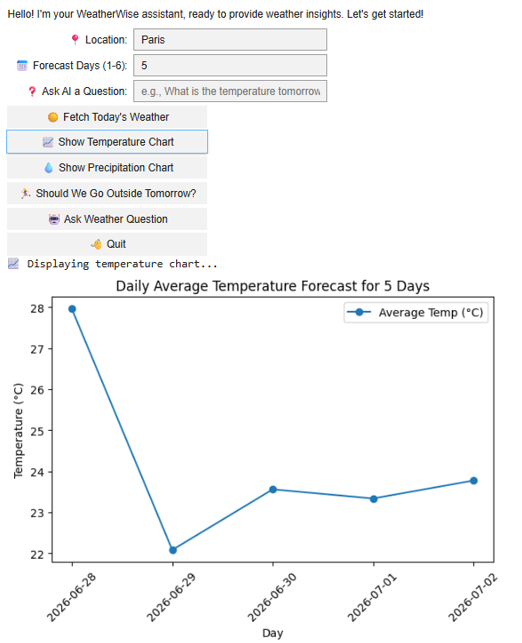

# 🌦️ WeatherWise — Smart Weather Advisor

Welcome to **WeatherWise**, a smart weather advisor application that combines live weather data with charts, rule-based advice, and natural-language weather questions.  
This project is based on the **WeatherWise Assignment Starter Template**, enhanced with custom logic, visualisations, and interface design developed by **Waranyu Bancherdvanich**.

---


---



---

## 🧩 Overview

**Features**
- 🌤️ Current weather and 5-day forecast  
- 📈 Temperature and rainfall charts  
- 💬 Natural-language weather questions  
- 🧠 Rule-based outdoor advice (“Should I go outside tomorrow?”)

**Core Components**
- API data retrieval and processing  
- Matplotlib visualisations  
- AI conversation feature  
- Interactive UI with `ipywidgets`

**Tech Stack:** Python · OpenWeatherMap API · matplotlib · ipywidgets

**My Contribution**
- Temperature and precipitation visualisations  
- Data-caching logic that avoids repeated API calls  
- Corrected “tomorrow” forecast indexing (mapping 3-hour data to full days)  
- The interactive `ipywidgets` interface

---

## ⚙️ Setup

Install dependencies:

```bash
!pip install hands-on-ai
!pip install pyinputplus
```

---

## 🔑 Set API Keys

```python
import os
os.environ['OPENWEATHER_API_KEY'] = 'YOUR_OPENWEATHER_API_KEY'
os.environ['HANDS_ON_AI_API_KEY'] = 'YOUR_AI_API_KEY'
```

Get your keys from:  
🌐 https://openweathermap.org/  
🌐 https://ollama.com/

---

## ⚙️ How It Works

**WeatherWise** follows a simple **data → analysis → output** pipeline.

---

### 🌐 1. Fetch Weather Data
- The app calls the **OpenWeather API** using the selected city and units (°C/°F).  
- Data includes temperature, humidity, rainfall, and a 5-day forecast.

---

### 🧮 2. Process and Organise Data
- Functions extract the relevant fields (min/max/average) and aggregate the 3-hourly readings into daily figures.  
- The data is cleaned and structured for visualisation.

---

### 📊 3. Visualise the Forecast
- `matplotlib` generates **line charts** (temperature) and **bar charts** (rainfall).  
- Users can easily understand weather patterns at a glance.

---

### 🤖 4. AI Interaction
- User questions (e.g., *“Will it rain tomorrow in Perth?”*) are parsed by `parse_weather_question()`.  
- `generate_weather_response()` builds a prompt from the forecast data and sends it to an LLM for a natural-language answer.

---

## 🧭 5. User Interface

**Interactive options (via `ipywidgets`):**
- 📍 Enter location & forecast days *(use a city name, e.g. `Bangkok`, not `Thailand`)*  
- ☀️ Fetch Today’s Weather  
- 📈 Show Charts  
- 🏃 Should We Go Outside Tomorrow?  
- 🤖 Ask Weather Question  
- 👋 Quit Session  

---

## 💡 Example

| Step | Action | Result |
|------|---------|--------|
| 1 | Enter: `Paris` | Loads weather data |
| 2 | Click: ☀️ *Fetch Weather* | Shows current temperature summary |
| 3 | Click: 📈 *Show Temperature Chart* | Displays the daily forecast chart |

---

## 🎯 Project Purpose

**WeatherWise** integrates APIs and data visualisation to make weather information more interactive and insightful.  
It demonstrates how live data, charts, and simple logic can support everyday decisions.

---

## 🧠 AI Conversations

All prompt logs are saved in `/ai-conversations/`.  
See **[PROMPTING.md](PROMPTING.md)** for five intentional prompting techniques with before/after code.

---

## 🔍 Known Limitations & Future Improvements
- The natural-language AI feature was built against a course-provided LLM server that is no longer available, so that specific feature may not run live. The weather retrieval, charts, and rule-based advice all work independently of it. A future version could point this feature at a hosted LLM API (such as ollama.com cloud) to restore it.
- The question parser uses a simple keyword heuristic to detect location, which can misread the location in some phrasings. A future version could use named-entity recognition for more reliable parsing.
- Outdoor advice is rule-based (temperature thresholds), which is reliable and transparent; a future version could blend this with the AI model for richer suggestions.
